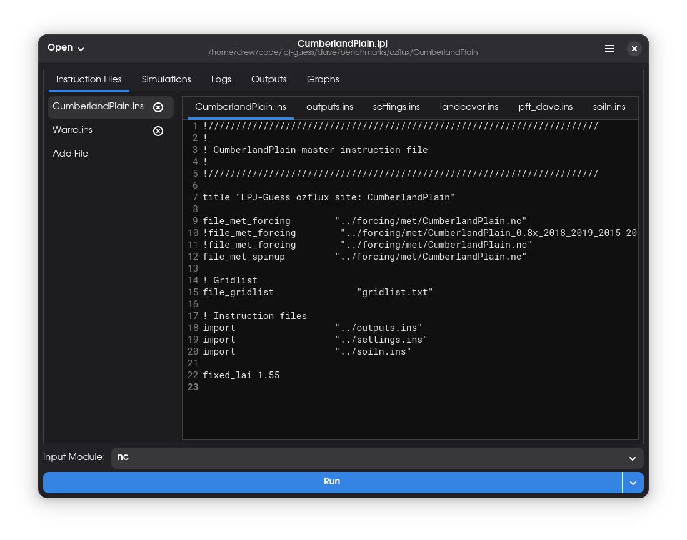
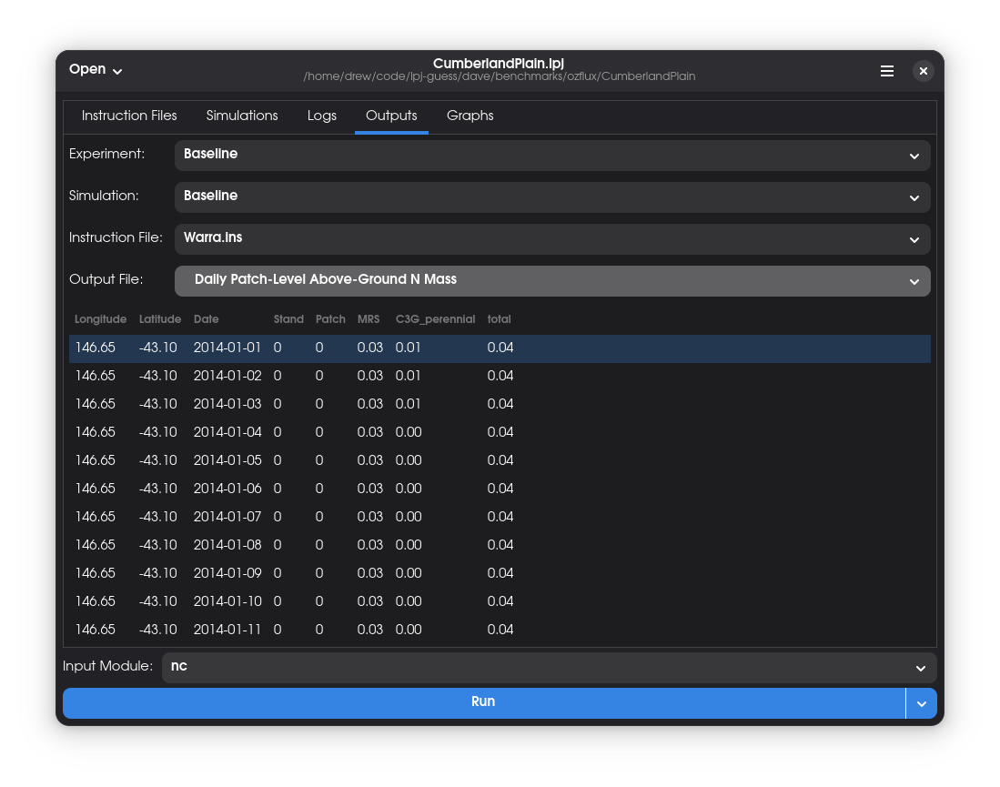
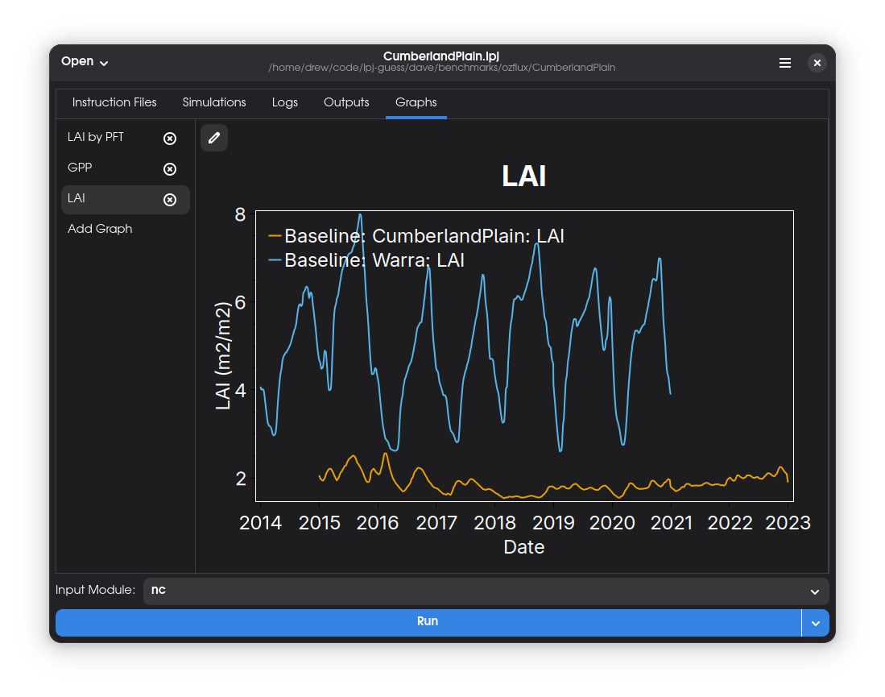
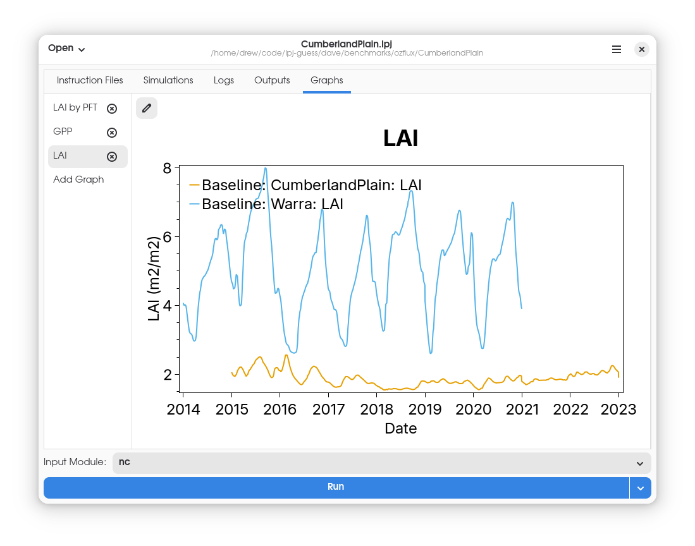
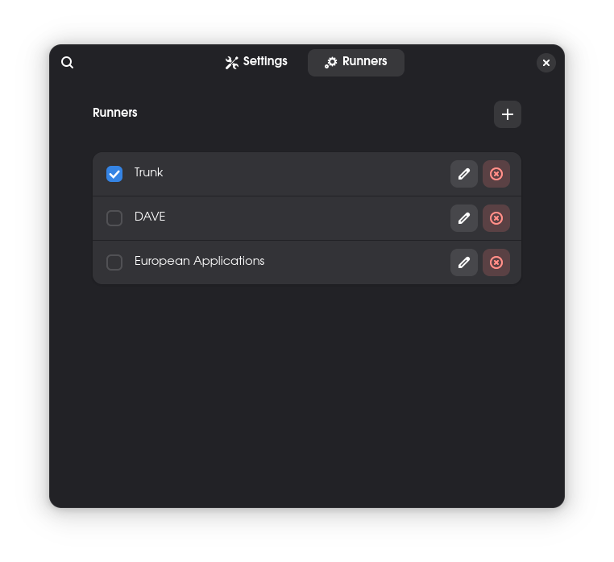

# LPJ-Guess GUI

[](https://github.com/hie-dave/lpjg-gui/actions/workflows/ci.yml)

A simple cross-platform LPJ-Guess graphical frontend and simulation runner.

## Requirements

- Gtk4
- libadwaita
- .NET 9 SDK
- Working local build of LPJ-Guess (technically optional, but required in order
  to do anything useful)

Note that Gtk4 and libadwaita are not required for using the runner in
standalone mode - they are only required for the GUI. Platform-specific
installation instructions for these two packages are provided below.

### Windows

- Install [MSYS2](https://www.msys2.org/)
- Run `pacman -S mingw-w64-clang-x86_64-libadwaita`

### MacOS

Install dependencies with homebrew:

```bash
brew install dotnet-sdk libadwaita adwaita-icon-theme
```

### Linux

Install the following packages:

- Gtk4
- libadwaita
- .NET 9 SDK

## Build

Prerequisites:
- .NET 9 SDK
- Python 3.11 (if building wheel)

The solution may be built in an IDE of choice, or using the provided Makefile
or .NET CLI:

```bash
# Clone the repository with submodules
git clone --recurse-submodules git@github.com:hie-dave/lpjg-gui.git

make
# dotnet build src/LpjGuess.sln
```

Unit tests may be run using the provided Makefile or .NET CLI:

```bash
make check
# dotnet test src/LpjGuess.sln
```

## Run

### GUI

The GUI may be run via an IDE of choice, or via the provided Makefile or .NET
CLI:

```bash
make run
# dotnet run --project src/LpjGuess.Frontend
```

The GUI requires no CLI arguments, but some optional arguments may be passed to
control the logging. Run with `--help` to view the available CLI options.

### Simulation Runner

The simulation runner provides a way to run a set of LPJ-Guess instructions
multiple times by varying parameters in the instruction files. Generated
simulations can be run locally, or submitted to PBS for execution.

The simulation runner may be run via command-line interface or via the python
bindings. If using the CLI, all options are passed via a .toml file. The CLI
requires one argument - the path to the .toml file:

```bash
dotnet run --project src/LpjGuess.Runner.CLI -- <myconfig.toml>
```

An [example .toml file](example.toml) containing all available options is
present in the repository.

### Python Bindings

The python bindings to the runner tool are currently the best way to run large
numbers of simulations with non-trivial parameter combinations. The bindings
may be built locally, or installed from PyPI:

```bash
pip install lpjguess-runner
```

For more detailed information, consult the
[PyPI page](https://pypi.org/project/lpjguess-runner/).

## Screenshots






